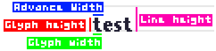

# Tinyfonts

A collection of tiny fonts, a tool for editing them, and a library for rendering them.

## Editor

- <kbd>shift n</kbd> Create a new font
- <kbd>e</kbd> Export font settings
- <kbd>cmd v</kbd> Set the font's image texture (paste)
- <kbd>←</kbd> Select the previous glyph
- <kbd>→</kbd> Select the next glyph
- <kbd>↑</kbd> Select the glyph in the row above
- <kbd>↓</kbd> Select the glyph in the row below
- <kbd>cmd ←</kbd> -1 to font glyph width
- <kbd>cmd →</kbd> +1 to font glyph width
- <kbd>cmd ↑</kbd> -1 to font glyph height
- <kbd>cmd ↓</kbd> +1 to font glyph height
- <kbd>shift ←</kbd> -1 to x offset for the current glyph
- <kbd>shift →</kbd> +1 to x offset for the current glyph
- <kbd>shift ↑</kbd> -1 to y offset for the current glyph
- <kbd>shift ↓</kbd> +1 to y offset for the current glyph
- <kbd>alt ←</kbd> -1 to advance width for current glyph
- <kbd>alt →</kbd> +1 to advance width for current glyph
- <kbd>alt ↑</kbd> -1 to font line height
- <kbd>alt ↓</kbd> +1 to font line height

## Metrics

Here's a reference for the various font metrics.



- **Glyph width**: The width in pixels of each cell in the font's texture.
- **Glyph height**: The height in pixels of each cell in the font's texture.
- **X Offset**: The number of pixels to shift the glyph horizontally when drawing it.
- **Y Offset**: The number of pixels to shift the glyph vertically when drawing it.
- **Advance width**: The number of pixels to advance before writing the next glyph. A narrow glyph like `I` usually has a small advance width, whereas a glyph like `W` has a large advance width. Defaults to _glyph width_.
- **Line height**: The number of pixels to descend before writing the next line of text. Defaults to _glyph height_.

## Rendering

I'm not planning on publishing the rendering code anywhere, so if you want to use it, just copy `font.js` into your project.

Create a font by combining the font's image with font settings (you can export these settings from [the editor][editor]).

```js
import { Font } from "./font.js";

let fontImage = new Image();
fontImage.src = "/path/to/font.png";

let font = new Font(fontImage, {
  // The width of each glyph cell in pixels
  glyphWidth: 5,
  // The height of each glyph cell in pixels
  glyphHeight: 8,
  // The height of each line in pixels
  lineHeight: 9,
  // The character code of the glyph at 0, 0
  startCharCode: 32,
  // A table of chars/char codes to advance widths
  advanceWidths: {
    32: 4, // Advance 4px for each " "
    " ": 4, // Alternative syntax
  },
  // A table of chars/char codes to x offsets
  xOffsets: {
    73: 1 // Horizontally offset "I" by 1px
    "I": 1 // Alternative syntax
  },
  yOffsets: {
    121: 1 // Vertically offset "y" by 2px
    "y": 1 // Alternative syntax
  },
});
```

### Drawing

You can draw text to a canvas using the `drawText` function.

```js
drawText(
  ctx, // The CanvasRenderingContext2D for the canvas
  font, // The font to use when rendering
  "Some text to draw", // The text to draw
  x, // The x position to start drawing at
  y, // The y position to start drawing at
  "red", // The color to fill the text with
);
```

### Measuring

You can measure text using the `measureText` function.

```js
let { width, height } = measureText(font, "Some text to measure");
```

This is useful for knowing exactly how much space a given bit of text will take up.

[editor]: https://danprince.github.io/tinyfonts/
